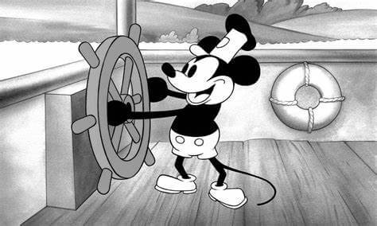
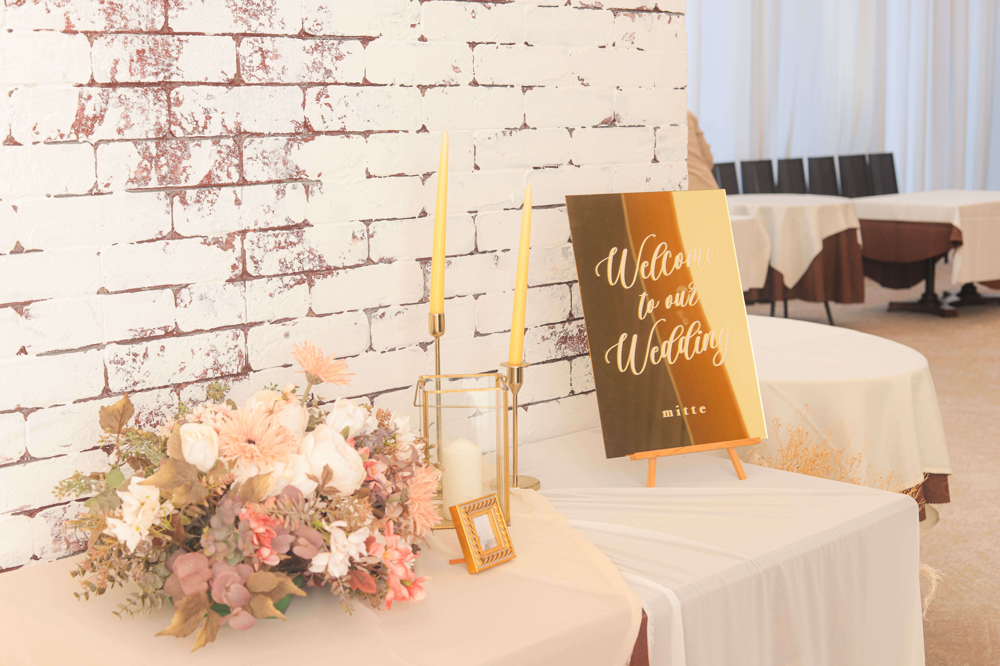

### 結婚式の制作物をご依頼いただきました。
 *** 
今回、私の方で制作させていただいたものは  
 - ・オープニングムービー(3分)
 - ・プロフィールムービー(8分)
 - ・プロフィールムービーに使用する似顔絵（新郎・新婦　計2枚）

※ご依頼者様のご意向で、制作した似顔絵を1枚の画像にしたwelcomeボード風画像のみ公開しています。  
### ディズニーが好きな新郎新婦の二人の構想を具現化したムービー作成
 *** 

#### 【オープニングムービー】
オープニングムービーは、蒸気船ウィリーのアニメーションを使用して、ディズニーアニメの世界の中に入り込んだような、新郎新婦紹介動画を作成いたしました。

#### 【プロフィールムービー】
ディズニーが好きなお二人の要望で、絵本のアニメーションを作成して、その中にお二人の物語を紡ぎました。
新婦さんがしっかりとしたイメージや構成を持っていらっしゃったので、とにかくそのイメージを忠実に再現することを意識しました。

また、それにプラスアルファのアイデアをご提案して、一緒に創り上げていったので、最終的にはとてもご満足いただけて、「想像よりも素敵なものができて満足です！」とお声もいただきました✨

#### 【こんなテイストで！とご要望のタッチでの似顔絵作成】
動画に似顔絵をいれたい！という構想があったので、似顔絵も作成いたしました。
ご要望のタッチが『リアル寄りのペン画タッチのおしゃれな似顔絵』というイメージだったので、それにお応えしてお写真からの似顔絵制作をしました。

動画に使用するのが目的だったので今回はデジタル似顔絵にしましたが、welcomeボードなどの場合はイラストボードにお描きすることも可能です。
色鉛筆やコピック、パステル、パンパステルなどいろんな画材を使用して、お客様のイメージを具現化した似顔絵の制作が可能です。

### 制作に携わって思うこと
 *** 

今回、結婚式という人生においての一大イベントのお手伝いをさせていただきました。
新郎・新婦さんお二人の「こんな結婚式にしたい！」のイメージに沿って、制作をさせていただき、お二人の結婚式に対する気持ちや熱量を感じながら、一緒に創り上げさせていただきました。

制作作業は私が一人でおこないましたが、実際に素敵な制作物が創れたのはお二人の力もあってのことです。
最後まで妥協せず、細かい部分もより良くなるよう修正したり、準備に忙しい中、動画内のコメントをたくさん考えていただいたりもしました。

私自身、とても楽しく制作させていただきました。
本当にありがとうございました。
お客様一人一人、いろんな目的をもって、制作依頼をされるとおもうので、そこに最大限寄り添ったお仕事を心がけて、これからもいろんなものを創り上げていきたいと思います。

三宅　葵
