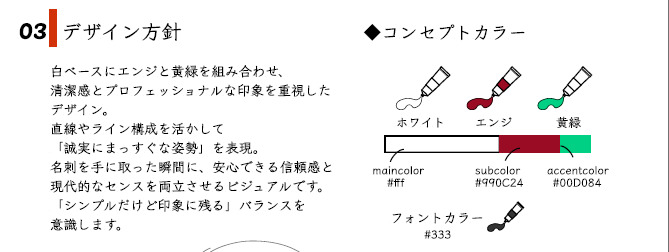

 ### 今回はタクシー乗務員の方の名刺デザインをご依頼いただきました！
今回は、タクシー乗務員をされているご依頼者様の、名刺デザインをさせていただきました。
まずヒアリングをさせていただき、どういった目的で使いたいのか、ターゲットは誰なのか、どういったシーンでのお渡しをお考えか、などをヒアリングして
コンセプトやデザイン方針をご提案させていただき、印刷所に入稿、現物のお届けという形で納品させていただきました！

 ### ヒアリング
 
まず初めにヒアリングフォームへのご回答をいただき、ターゲットやどんなシーンで使いたいか、どういった情報を記載したいのか、をお聞きします。

今回は、 **シンプルでかっこいい、フォーマルなデザイン** をご希望で、一度乗っていただいたお客様が下車する際にさらりとお渡しできるようなものをイメージしてご提案させていただきました。
京都を中心に走っているタクシー乗務員さんということで、海外の方もターゲットに含めて、英語の記載も提案しました。

**「また乗りたいと思えるタクシーに」** というキャッチコピーを配置して、2度目以降の利用も連想できるような名刺デザインを目指しています。

 ### 初回デザイン案のご提案
 
初回レイアウト案を含めた提案書をご確認いただき、ご承諾をいただけたらさっそく制作に取り掛かります✨
記載する情報の配置や内容の確認、キャッチコピーの配置や **「なぜこのレイアウトにしたのか？」** という部分のすり合わせをおこなっていきます。

参考にということで、勤め先のHPのURLを送っていただいたので、コンセプトカラーや企業の雰囲気などを大事にしつつ、全体のデザイン方針を考え、ご提案していきます。

 ### 初回デザイン案を３案提示させていただきその中の１案をベースに進めていきます
初回デザイン案をご提案させていただき、その中から **ベースにする１案** を選んでもらいます。
この時点ではデザインやレイアウトの方針を決める意味合いで作成していて、選んでいただいた１案をベースに調整を重ねていき、どんどん形にしていきます。

今回は、気に入っていただけたのが２案あったので、１案は調整したもの、２案はその２つを掛け合わせたようなデザインを再度ご提案させていただき、また感想をいただく…という形で仕上げていきました。

 ### 公式ラインでメッセージのやり取りをしながら一緒にデザインを創り上げていく
公式ラインでのやりとりをご希望いただいたので、メッセージのやり取りを重ねて、気になったことはどんどん言っていただきました。
「こんなデザインはできますか？」や「ここのロゴ部分をもうすこし抽象的に…」など、ご依頼者様の使いやすい名刺を目指します。

実際にこの名刺を使って営業していくのはご依頼者様なので、 **しっかりと気に入ったデザイン** であるのは必須事項です。
もちろんこちらとしても、ご乗車いただいたお客様に、誠実で安心できる運転を感じさせる名刺をコンセプトに、ここはこういう意図で配置しています、などもお声かけさせていただきます。
 ### 最終調整を重ねて用紙や印刷所の手配をしていきます
細かい部分の調整などを終え、記載情報の確認をしていただいたらいよいよ入稿フェーズです。

**モックアップ（実際の使用イメージ）** を送らせてもらい、ご希望の用紙で印刷の手配をしていきます。
郵送での送付になるので、お届けまで少しの間お待ちいただきます。

 ### 素敵な名刺になったと喜んでいただけました
無事、ご依頼者様から「無事に届きました」と連絡をいただきました。
合わせて **「素敵な仕上がりで非常に満足しています、自信をもってお渡しできる名刺になりました。」** とお褒めの言葉もいただけました！

データで見ていたデザインが実際に名刺の形になって、お手元に届くとまた一味ちがった感動があるもので、自分だけのオリジナルの名刺ということで、こだわったぶん愛着もわいてくるかと思います。

これからもたくさんのお客様を、タクシーに乗せるご依頼者様の「お顔」となって、少しでも **多くのお客様に繋がる素敵な名刺** として使っていただけることを願っています✨

今回もとても楽しく制作することができました。
改めて、ご依頼者さま、ありがとうございました！
このご依頼がきっかけで、自分の名刺も新調したくなり、１からデザインを作り直し、新しい名刺をお迎えしたのは、また別の記事でお話します・・・！(笑)

三宅 葵
