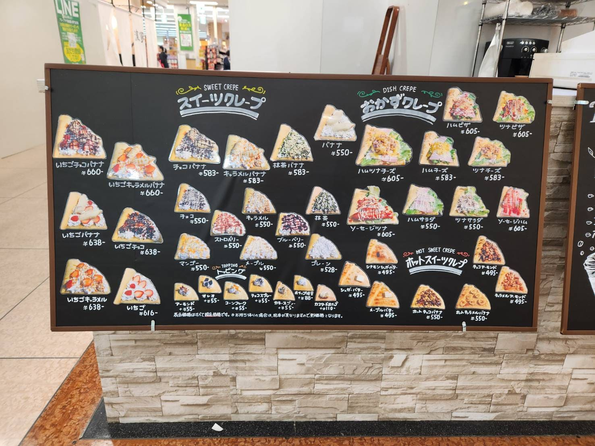
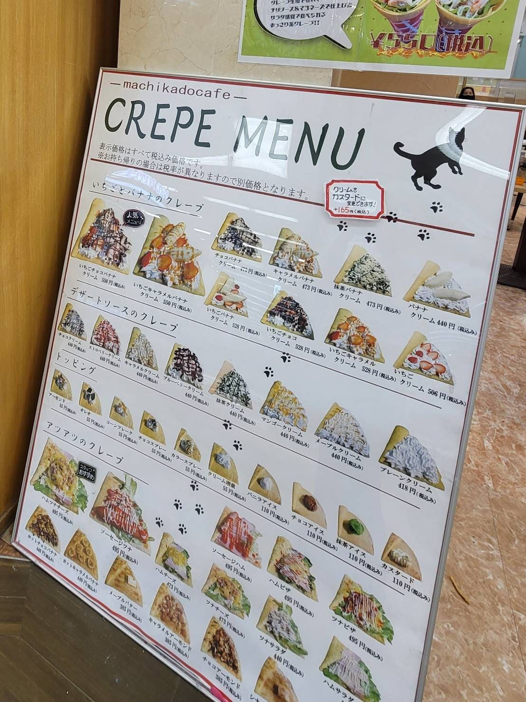
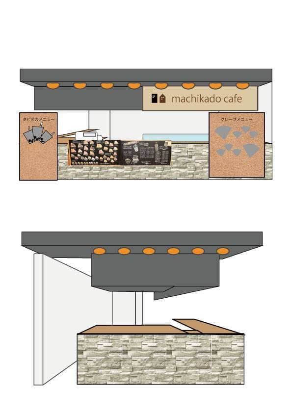
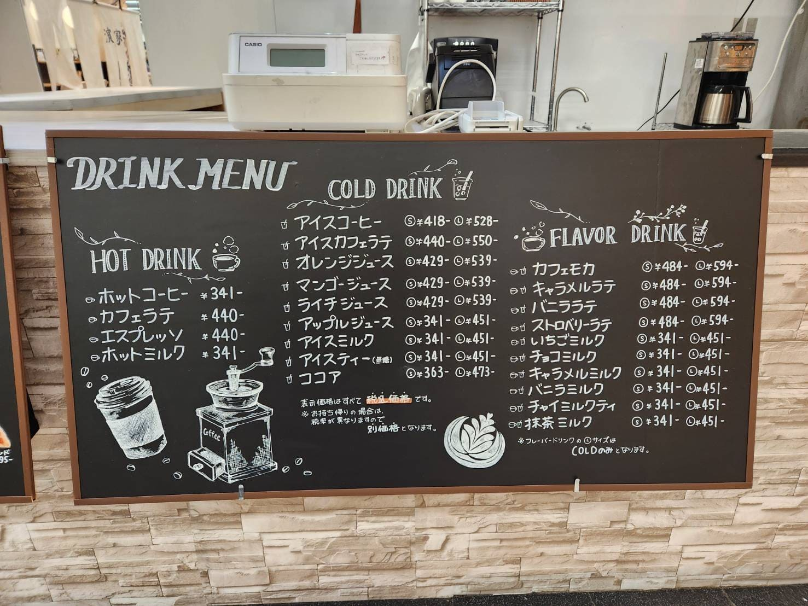
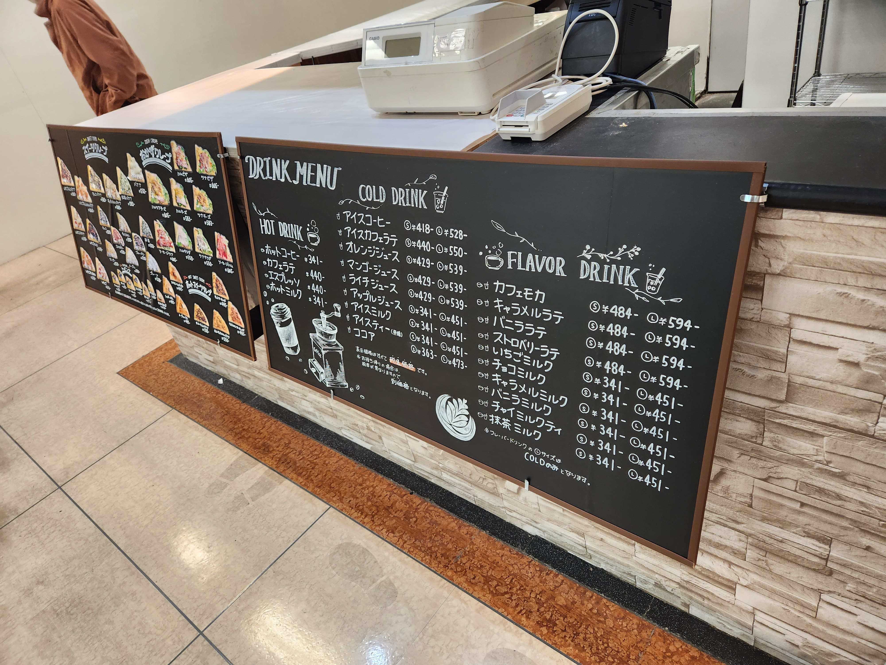
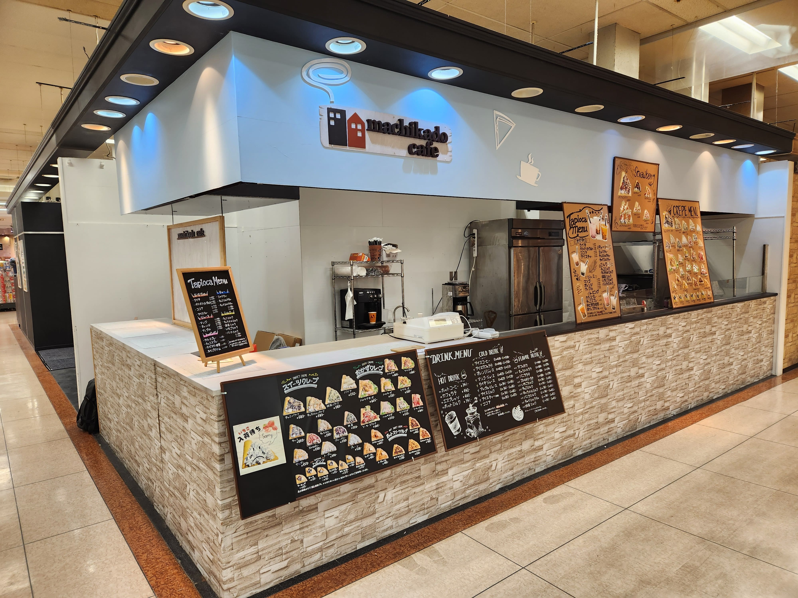

## ご依頼内容とお店について

 *** 
以前ホームページ制作をご依頼いただいた大阪府のクレープ＆カフェ店から、今回は店頭デザイン全体のリニューアルをご相談いただきました。ショッピングモール内のテナントであるため、立ち止まってもらえる“目を引く店頭づくり”が求められる環境です。

長く使用していたメニューはシンプルで、5年近く経過したことによる傷みも気になっていました。また、コロナ禍や物価高騰により原価が上がっているにも関わらず価格を据え置いて営業されてきた背景もあり、このタイミングで価格改定とメニュー全体の見直しも必要となっていました。

そういった状況の中で「店頭の印象を一新したい」とのご相談をいただき、私がデザインを担当することになりました。

## デザインコンセプト｜“あたたかさ”と“手作り感”をテーマに

### 手描きメニューを中心にした店頭づくり
 *** 

今回は、手書きのあたたかさを前面に出した店頭デザインを目指しました。ファミリーや学生さんなど幅広いお客様が訪れるため、「かわいい！」「入りやすい！」と感じてもらえる親しみやすい雰囲気を大切にしています。

### ファミリー・学生が足を止める「かわいさ」
 *** 
クレープという商品の可愛らしさを引き立てるため、明るく柔らかい印象を意識。遠くから見ても目に入りやすい色とレイアウトを意識しました。

### 安心感と特別感を両立した世界観
 *** 
お買い物の合間に立ち寄ってもらえるような“気軽さ”と、ちょっと特別なおやつ時間を楽しめる“ワクワク感”。その両方を感じてもらえるように、あたたかい手書き表現を中心に世界観づくりを行いました。

## 実際の制作プロセスを紹介

### ① ヒアリングで見えてきた価格改定・メニュー刷新の課題
 *** 

最初のヒアリングで見えてきたのは、価格改定・メニュー全面見直しの必要性でした。そこで「どのメニューを残すか」「どのように見やすく並べるか」を店主さんと一緒に整理し、店頭で迷わず選びやすい構成へと組み立てていきました。

### ② ラフ制作｜黒板・コルクの組み合わせとレイアウト検討
 *** 

メニュー構成が固まったあと、店頭のサイズや配置を考えながらラフを作成。黒板とコルクの組み合わせが生み出す温かみを活かし、どこから見ても読みやすく、魅力が伝わるレイアウトを提案しました。

### ③ 発色の良いポスカで描く黒板アート・白線デッサン
 *** 

実制作では、ブラックボードとコルクボードをベースに、発色の良いポスカを使用して黒板アート・ボードアートの手書き感を表現しました。カフェらしい雰囲気をつくるため、黒背景に白のデッサン風イラストを入れ、シンプルでおしゃれな印象にまとめています。

全体の統一感を持たせるため、タイトルの描き方・線の太さ・余白の取り方など細かな部分にも気を配りました。

### ④ 現場での設置調整｜角度・台の工夫とイレギュラー対応
 *** 

設置当日は、実際の導線に合わせて角度を調整したり、ボードを支える台をその場で工夫しながら作り上げたりと、現場ならではのイレギュラーがいくつか発生しました。

それでも店主さんと話し合いながら最もよい見え方を探り、試行錯誤を楽しみつつ作業を進めることができました。

## 完成した店頭デザインと反響
 *** 

完成後は、お客様から「これ手書き？すごい！」「センスがないとこんなの描けないよね」といった温かい声をいただきました。店主さんからも「かわいく仕上がっている」「とてもいい！」とのお言葉をいただき、手書きならではの魅力がしっかり伝わったことを感じました。

ショッピングモール内でも目を引くデザインとなり、店頭の印象を大きく底上げできた仕上がりになったと思います。

## 小さなお店に“手書きデザイン”が向いている理由
 *** 
* 初期費用を抑えながら個性が出せる
* SNS映えしやすい
* 親しみやすさ・距離感が自然に生まれる
* トータルデザインとして世界観を統一しやすい

特に小規模店舗や移動販売のオーナー様には、お店の“らしさ”を手描きで表現するデザインがとても相性の良い方法です。

## まとめ｜世界観づくりは店頭からはじまる
 *** 
店頭は、お客様が最初に触れるお店の“顔”。そこに温かさや特別感が宿ることで、お客様が自然と足を運びたくなる空間が生まれます。

今回のデザインが、カフェに訪れる方々の小さな楽しみにつながれば嬉しく思います。

三宅 葵
