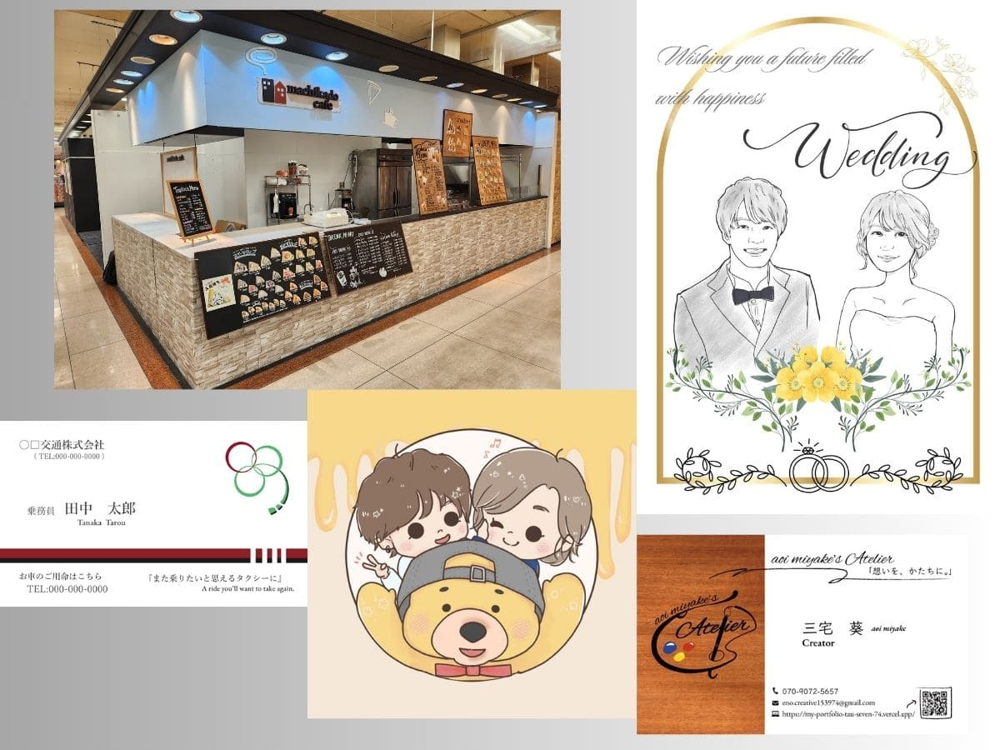
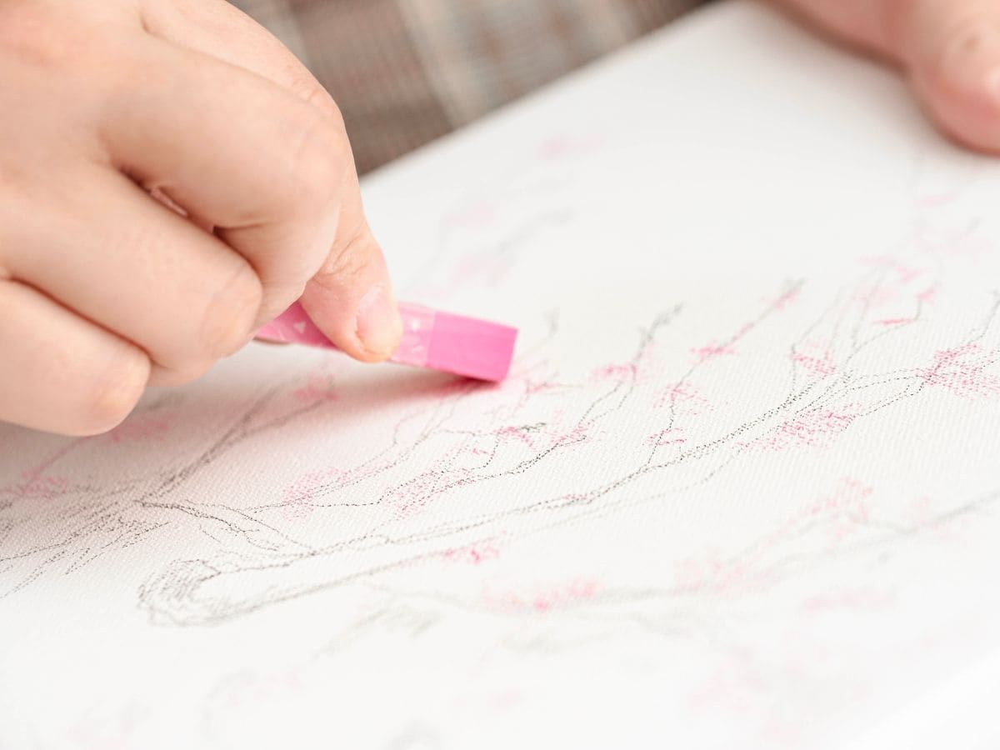
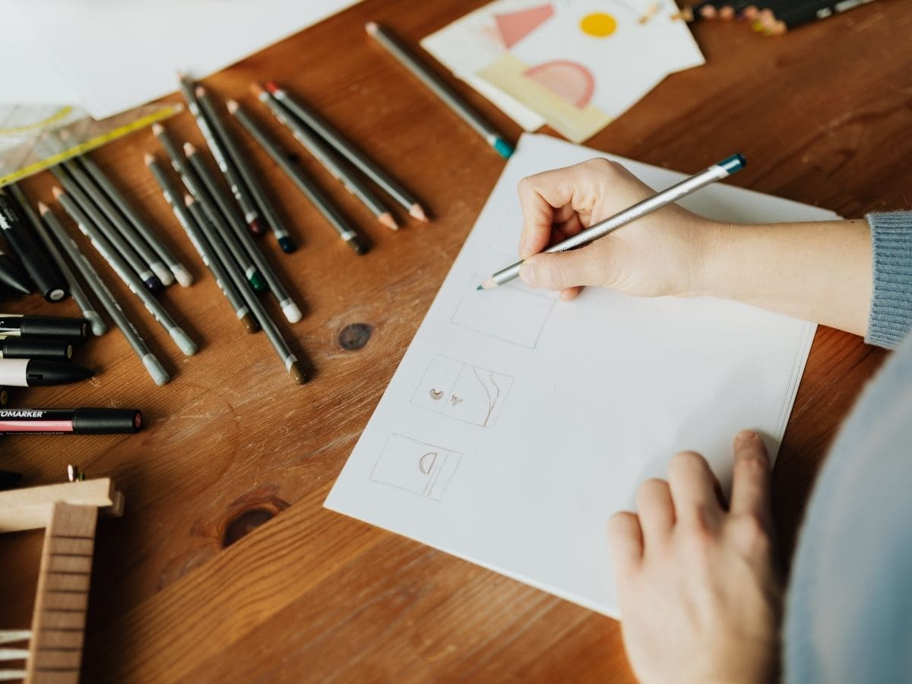

あけましておめでとうございます。
マルチクリエイターの三宅 葵（みやけ あおい）です。
2026年がはじまり、少し背筋が伸びるような、でもどこかワクワクする気持ちでこの文章を書いています。
ちなみに年越しは**仮眠で年越し**からの、2時頃に起きて年賀状の宛名書いてました(身内はもう郵送せずに手渡ししたりするので、笑)
今年もマイペースに創作活動してるなぁなんて思いながら新年を迎えましたね。

ちなみにタイトルの馬に乗ったイラストは、我が家の今年の年賀状のイラストです〶
せっかくなので載せてみました✨

---

## 2025年を振り返って

昨年2025年は、結婚式の動画制作や似顔絵制作、名刺のご依頼をいただいたり、お店のロゴや販促物、店頭まわりのトータルデザインを担当させていただいたりと、本当にさまざまなお仕事に関わらせていただいた一年でした。

毎回、新しい取り組みを交えながら試行錯誤する作業は、私自身とても楽しく、同時にたくさんの学びをもらえる時間でもありました。

そして何より、完成したものをお渡ししたときに

 **「お願いしてよかったです」**
 **「イメージ以上でした」**
 **「素敵なデザインをありがとうございます！」**

と喜んでいただける瞬間に、この仕事の大きなやりがいを感じています。

ご依頼くださった皆さま、関わってくださった皆さま、
本当にありがとうございました。

---

## 2026年の想い

2026年も変わらず、**「想いをかたちにする」ことを大切に**、小さなお店や個人で活動されている方に寄り添いながら、あたたかく伝わるデザインをお届けしていきたいと思っています。

Webデザイン、グラフィック、イラスト、手書きPOPなど、ジャンルにとらわれず、「その人らしさ」「そのお店らしさ」が伝わる表現を一緒に考えていけたら嬉しいです。

今年は昨年以上にいろんなスキルを獲得をしたいというのが目標です。
趣味で勉強している **２Dモデリング**や**DTM**などもプライベートでやりつつ、デザイン系のスキルやプロンプトエンジニアリングなどの勉強もしていきたいなと思っています。

プライベートもお仕事も充実させる一年を目指していきたいですね！
コツコツとがんばります！✨

---

## ご相談について

デザインのことって、

 **「何から相談すればいいのか分からない」**
 **「予算感が合うか不安」**

と感じる方も多いと思います。

ご相談やお見積もりは無料で、まだ形になっていない段階のお話でも問題ありません。
お話を伺いながら、できること・できないことも含めて、正直にお伝えしています。

「こんなこと頼める？」という小さな疑問からでも大丈夫です。
気になることがありましたら、どうぞお気軽にお問い合わせください。

---

本年もどうぞ、よろしくお願いいたします。
三宅　葵