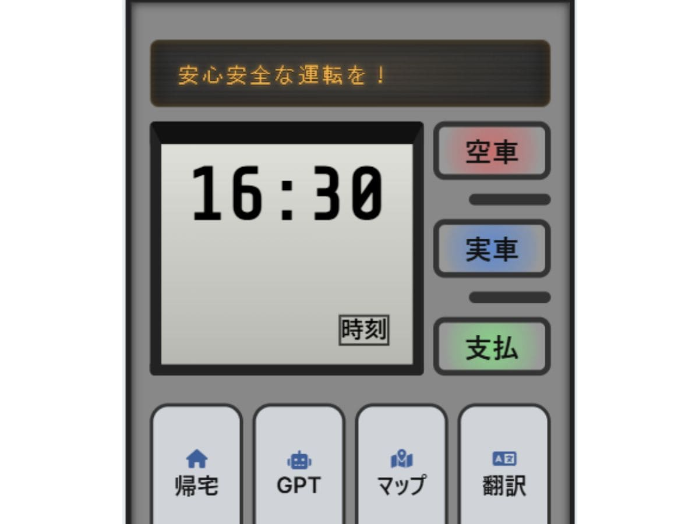
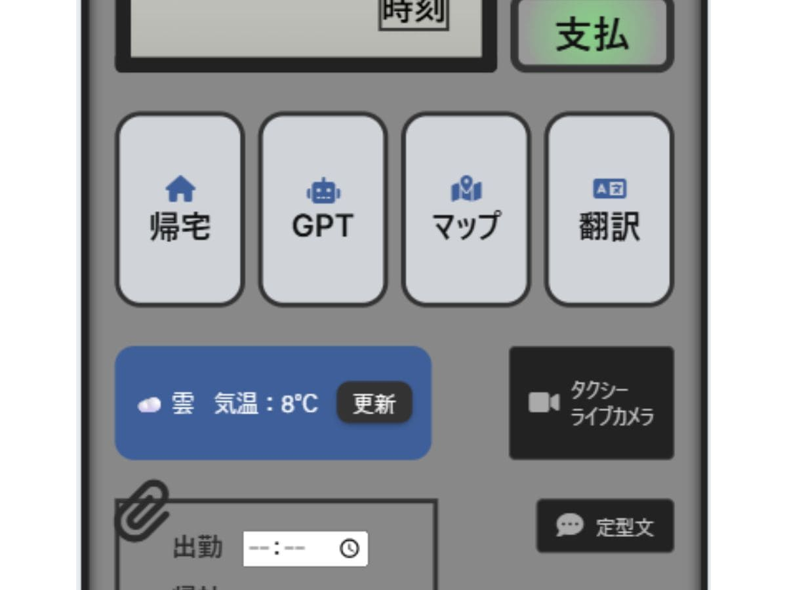
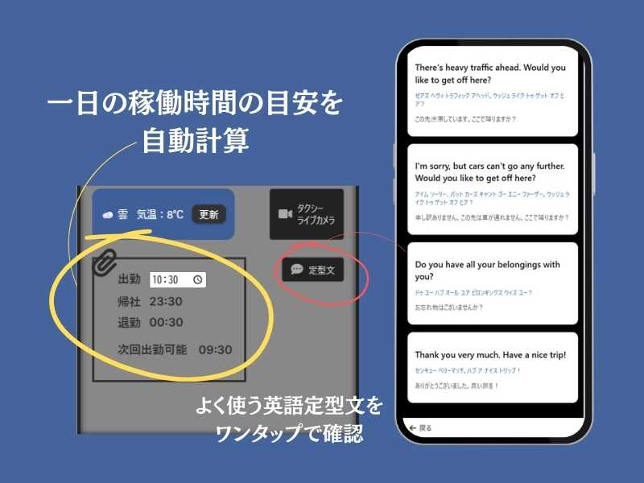
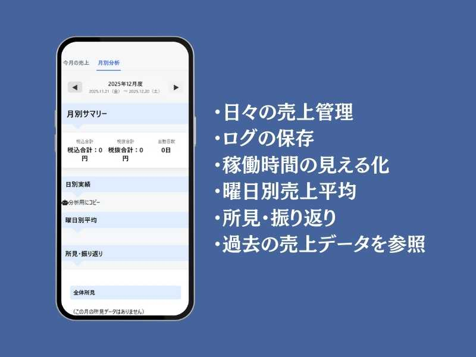

タクシー運転手の業務を支援するWebアプリを、個人で開発しました。

きっかけは、家族から聞いた現場の困りごとです。  
売上管理や稼働時間の把握は、数字としては存在しているのに、  
“使える形”にはなっていませんでした。

本記事では、実際の運用を前提に設計した業務支援Webアプリの開発背景と、  
UI設計・時間計算ロジック・データ構造の工夫についてまとめています。

個人開発ではありますが、「使われること」を前提に考えた設計の記録です。

---

## 開発の背景・きっかけ

### なぜこのアプリを作ろうと思ったか

このタクシー運行支援Webアプリは、家族にタクシー運転手がいることがきっかけで生まれました。

タクシー会社に勤めているものの、実際の働き方はかなり個人裁量に任されている部分が多く、  
日々の稼働時間・残業時間・休憩時間などは基本的に自己管理が求められます。

さらに歩合制という特性上、売上はそのまま給与に直結します。  
つまり、売上管理と稼働管理は生活に直結する重要な要素です。

身近で話を聞く中で感じたのは、

- 稼働時間を正確に把握するのが意外と難しいこと  
- 売上の振り返りが感覚に頼りがちなこと  
- 「ちょっと確認したい」がすぐにできないこと  

でした。

かなりニッチな用途になると感じたため、既存サービスは検討せず、  
それならば身近な課題にフィットする形で自分で作ってみようと考えました。

売上管理ができること。  
稼働時間を正確に把握できること。  
そしてタクシー運行中に「すぐアクセスできると便利」な機能をまとめること。

そうした発想から、この業務支援Webアプリの開発を始めました。

---

## 解決したかった業務上の課題

### 稼働時間が把握しづらい問題

タクシー会社では、日々の日報は紙ベースで行われていることが多く、  
売上も支払い方法ごとに手計算で整理するケースがあります。

さらに、出庫から帰社までの最大稼働時間は会社規則で定められているものの、  
出勤時間は自己管理であるため、毎回「あと何時間動けるのか」を頭の中で計算する必要があります。

日付を跨ぐ勤務もあるため単純な引き算では済まず、

- 計算違いによる誤解  
- 規則内かどうかの不安  
- 本来使うべき集中力を別の計算に使ってしまう  

といった課題がありました。

これは技術的に難しい問題というより、  
“脳のリソースを奪っている問題”だと感じました。

---

### 売上の振り返りが感覚頼りだった点

売上は毎日日報として提出され、事務に依頼すれば集計も可能です。  
しかし、それは数日前までの情報であることが多く、リアルタイム性に欠けていました。

日々の勤務で疲れている中、  
さらに売上を取りに行くというひと手間が負担になります。

結果として、

- 今日はなんとなく良かった  
- このエリアは強い気がする  
- この時間帯の動きが良かった  

といった感覚は蓄積されるものの、  
目に見える形で残す仕組みはありませんでした。

データはあるのに、活かせていない。  
そこに改善の余地を感じました。

---

## アプリで実現したこと

### タクシーメーターを意識したUI設計

UIは、昔ながらのタクシーメーターをイメージして設計しています。  
実際の車両に近い雰囲気に寄せることで、直感的に使えるようにしました。

ボタンも「実車」「空車」「支払」と実際の用語を採用。

- 「支払」→ 売上記録パネル表示  
- 「空車」→ ログ入力パネル表示  

空車時間に気づいたことを記録できるようにしています。

説明がなくても「押せば分かる」設計を意識しました。

---

### メーター液晶風パネルと情報切り替え
中央の液晶風パネルには大きく時計を表示。  
稼働時間を意識する仕事だからこそ、時刻の視認性を優先しました。

必要な情報はボタン操作で切り替える仕様にし、  
常に情報を詰め込みすぎない設計にしています。

---

### 電光掲示板風デザインと応援表示

メーター上部には電光掲示板風の表示エリアを設置。

ランダムな応援コメントや社内会議日程を表示させ、  
業務支援アプリでありながら少しの遊び心を加えました。

---

### ワンタップで使えるツール集約設計

翻訳ページへのリンクを組み込み、

- 通常タップ：日本語 → 英語  
- 長押し：日本語 → 中国語  

といった直感的な操作を実装。

WebアプリでありながらPWA化しており、  
端末のホーム画面にアイコンを設置して使用しています。

出庫したらすぐアクセスし、スマホホルダーに固定して常時表示。  
実際の業務ツールとして運用されています。

---

## 設計・実装で工夫した点

### 日付を跨ぐ時間計算の考え方

会社規定では朝5時を1日の切り替わりとするルールがありました。

そのため内部では `businessDate` という業務上の日付を持たせ、  
朝5時を境に勤務日を判定する仕組みにしています。

単純な日付処理ではなく、  
現場ルールに合わせた設計を優先しました。

---

### 出勤時間を起点にした自動計算

出勤時間を入力すると、

- 帰社目安時間  
- 退勤可能時間  

を自動計算する仕組みを実装。

出勤時間はローカルストレージに保持し、  
売上記録ボタンを押すと稼働時間も自動的に紐づけて保存されます。

入力箇所を減らし、  
売上管理を“面倒な作業”に感じさせないことを重視しました。

---

### データ構造の設計方針

データベースには Firebase の Firestore を使用。

売上データには `memo` フィールドを持たせ、  
その日の振り返りを一緒に保存できるようにしています。

さらに `driverLog` コレクションを設け、  
好きなタイミングで気づきを記録可能にしました。

現在は月別集計が主ですが、  
将来的にフィールド追加できる拡張性を持たせています。

集めたデータはカスタムGPTで分析し、  
月間・曜日別の所見としてまとめています（手動運用）。

個人開発ならではの柔軟な仕組みです。

---

## 現在の仕様と制限事項

### 編集・削除UIについて

編集・削除UIは現在未実装です。

優先順位としてコア機能を安定させることを先に行いました。

今後実装する際は、

- 誤操作リスク  
- データ整合性  
- 直感的な操作性  

のバランスを丁寧に設計したいと考えています。

---

## 学びと今後の展望

本アプリは HTML・CSS・JavaScriptのみで実装しています。

あえてフレームワークを使わず、  
ブラウザの仕組みや状態管理を基礎から理解することを優先しました。

PWA化によって実運用可能な形にし、  
実際に日々の業務で使用されています。

小さな現場課題から始まった個人開発ですが、  
実際に使われる中で、設計の大切さを学び続けています。

今後はフロントエンド技術の向上に加え、  
設計力や安全性をさらに高めていきたいと考えています。
