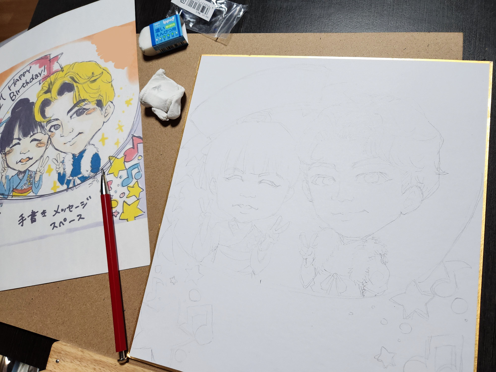
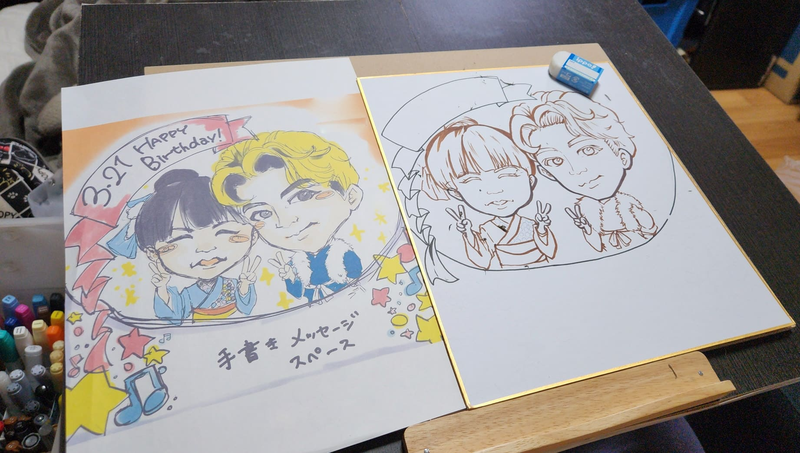
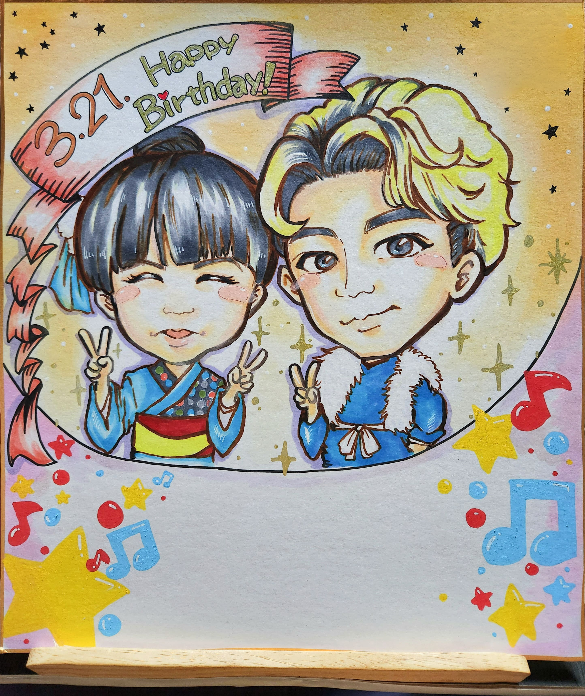

## 大切な人への贈り物として、似顔絵のご依頼をいただきました。

手書き似顔絵の制作事例として、今回のご依頼内容や制作の流れ、こだわりをご紹介します。

今回のご依頼は、
ダンスや寸劇をされている団体のメンバーの方から。
お世話になった先輩の卒業と誕生日をお祝いするためのプレゼントとして、
似顔絵を制作させていただきました。

過去にもご依頼いただいたことのある方で、
「いい感じにお任せで！」と信頼して任せていただけたことも、
とても嬉しく印象に残っています。

## ご依頼内容とイメージ

ご要望としていただいたのは、

・公演での衣装を取り入れたい
・仲の良さが伝わる雰囲気にしたい
・メッセージを書けるスペースがほしい
・明るい印象にしたい

あとはお任せ、という形でした。

だからこそ、ただ似ているだけでなく、
**「もらって嬉しい似顔絵」**になるように、
かわいらしさや温かさも大切にしたいと考えました。

## 制作前に大切にしたこと

今回特に意識したのは、
**“お二人の関係性が伝わる一枚にすること”**です。

ご依頼いただいた団体の公演紹介サイトを拝見し、
衣装の雰囲気や世界観を参考にしながら、
ただの舞台シーンではなく、
“舞台裏のような、和気あいあいとした空気感”を表現したいと考えました。

同じチームの仲間としての親しさ、
先輩後輩としての距離感。

その絶妙なバランスを、
一枚の中で自然に感じられるよう意識しました。

## 手書き似顔絵の制作過程
### 下書き

まずは全体のバランスを取りながら、
表情や雰囲気を大切にラフを描いていきます。

### 線画

下書きをもとに、一本一本丁寧に線を整えます。
手書きならではのやわらかさを残すことを意識しています。

今回は線の色をコピック（アルコールマーカー）の濃いめの茶色にしました。
黒よりもやわらかく、全体の雰囲気になじむよう意識しています。

### 色付け

全体は明るくカラフルに仕上げつつ、
コピックや色鉛筆を使って色を重ね、
背景や肌にはパンパステル（やわらかい粉状の画材）を使用し、
ふんわりとした柔らかさと温かみを加えています。

メッセージを書けるスペースを下に作り、その周りはポスカでポップに仕上げました。

## 制作のこだわりポイント

特にこだわったのは、“距離感”です。

恋人や家族とは違う、
でも確かに近くてあたたかい関係。

ただぎゅっと寄せるのではなく、
自然な距離の中に親しみや親密さがにじむように、
配置や表情を丁寧に調整しました。

贈られた方が、月日が経ってふと目にしたときに
楽しい思い出が自然とよみがえるような一枚を目指しました。

## 完成した似顔絵と感じたこと

完成した似顔絵は、
明るく楽しい雰囲気の中に、
やさしさがにじむ一枚になったと感じています。

※実際の制作ではロゴを入れていますが、掲載用に一部加工しています。

お客様からも
「すごくかわいい！」と喜んでいただけて、
その言葉がとても嬉しく、印象に残っています。

似顔絵は、ただ似ているだけではなく、
その人との時間や想いまで一緒に届けられるもの。

今回の制作を通して、
あらためてその魅力を実感しました。

## 手書き似顔絵の魅力

手書きの似顔絵には、
デジタルにはないやわらかさと温度があります。

線の揺らぎや色のにじみが、
そのまま“味”として残ります。

世界でたった一枚しかない作品で、
贈り主からのお手紙のような存在になります。

だからこそ、
大切な人へのプレゼントや記念として、
特別な一枚になるのだと思います。

### こんな方におすすめです

・大切な人へのプレゼントを探している方
・記念に残る特別なものを作りたい方
・あたたかみのある表現が好きな方

大切な人へのプレゼントや、記念に残る一枚として、
似顔絵制作のご相談も承っています。

一枚一枚、想いに寄り添いながら制作しています。
ご相談だけでも、お気軽にお問い合わせください。

#### 使用画材

・コピック
・色鉛筆
・パンパステル
・ポスカ など